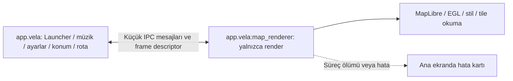

# Harita sürecini ayırma ve adım adım teşhis planı

Tarih: 5 Ekim 2026. Çalışılacak dal: **main**. Başlangıç commit'i: **d67a33a3c3d954346df607fe363679d6070c4b1e**.

## 1. İstenen sonuç

Launcher ana ekranı, Desktop workspace, müzik, ayarlar, yedekleme ve Home davranışı harita motorunun hatası yüzünden kapanmamalı. Harita ayrı süreçte çalışmalı. Yakalanabilir hatalar loga yazılmalı; harita alanında kısa bir açıklama ve elle yeniden deneme bulunmalı. Native süreç ölümü veya timeout da ana ekranda durum olarak gösterilmeli. Otomatik yeniden deneme/çökme döngüsü olmamalı.

Bu plan henüz uygulanmış süreç izolasyonu değildir. Mevcut sürüm yalnızca haritayı kullanıcı açana kadar başlatmıyor. Her aşama ayrı commit ve ayrı teyp denemesiyle ilerleyecek. Bir aşama başarısızsa sonraki aşamaya geçilmeyecek; son çalışan aşama kullanılacak.

## 2. Yedek ve geri dönüş

Yedek dizini:
`D:/Projects/CarWorkspace/Vela-backups/2026-10-05-map-process-before-d67a33a3`

| Dosya | İçerik |
|---|---|
| repository-all-refs.bundle | Tüm mevcut Git refleri ve geçmişi; yaklaşık 254 MB |
| source-main.zip | d67a33a3 commit'indeki kaynaklar; yaklaşık 32 MB |
| local-files.zip | Git dışındaki yerel dosyalar, eski/yeni loglar ve varsa yerel yapılandırma/imzalama dosyaları; yaklaşık 58 MB |
| BACKUP_MANIFEST.json | Tam commit, dosya boyutları, SHA-256 ve yerel dosya listesi |
| GERI_YUKLEME.md | Mevcut projeyi ezmeden yeni dizine geri yükleme talimatı |
| bundle-verification.txt | Git bundle doğrulama çıktısı |

Yedek alınırken tracked/staged değişiklik yoktu. Bundle doğrulaması ve iki ZIP'in CRC kontrolü başarılı. Derleme önbellekleri ve üretilmiş build dizinleri kapsam dışı. Bu yedek telefon/teyp verilerini içermez. Yerel arşivler Git'e veya GitHub'a eklenmez. Her uygulama aşamasından önce çalışma durumu kaydedilir; geri alma için main history'sini reset/force-push etmek yerine ilgili değişiklikler revert edilir. Yedekten tam kurtarma gerekiyorsa önce yeni boş dizine klonlanır.

## 3. Mevcut bulgular ve sınırlar

- Teyp: alps L9211B, **API 27**, 32-bit `armeabi-v7a`. ROM sürüm metninde Android 10 yazması API 27 sınırlamalarını değiştirmez. Vela'nın gerçek minSdk'sı 26, compileSdk'sı 36.
- Son sürüm 0.4.67'de müzik indeksi 3767 parça/59 klasörle yükleniyor; otomatik tarama başlamıyor.
- Yeni rapor exception stack'i değil, beklenmedik süreç sonlanması raporu. Son işlem `map: create texture=false`; bu son işlem tek başına kesin çökme nedenini kanıtlamaz.
- Önceki 0.4.34 raporlarında `IllegalArgumentException → EGLImpl.eglCreateContext` var. Yeni süreç ölümünün aynı hata olduğunu doğrulamıyoruz.
- Çevrimdışı harita yüklenmeden de MapLibre/EGL başlatılıyor. Harita dosyalarını silmek grafik başlangıcını kapatmıyor.
- `CarIntegration.MapContainer` elle açılış kapısını taşıyor. `VelaMapView` çok sayıda harita davranışını tek görünümde topluyor. `MapViewModel` konum, arama, rota, ses ve veri depolarını birlikte yönetiyor.
- `CarMapRenderer` zaten MapSnapshotter ile Android Auto görüntüsü üretiyor; yeniden kullanılabilecek yaklaşım mevcut. `VelaMapView` ayrıca 768×768 warm snapshot oluşturuyor. İzolasyon sınırı yalnızca MapView değil, bütün native render/snapshot girişlerini kapsamalı.

Bir Java exception'ı ayrı render thread'inde yutmak güvenli toparlanmayı garanti etmez. SIGSEGV/SIGABRT'yi normal try/catch ile kurtarmaya çalışmayacağız. Ayrı süreç launcher'ı renderer süreç ölümünden ayırır; sistem genelindeki GPU sürücüsü çökmesi veya sistemin ana süreci bellek baskısıyla öldürmesi yine mutlak olarak önlenemez.

## 4. Mimari kararı ve API 27 görüntü yolu

Ana süreçte tek veri sahibi korunacak: konum, rota hesaplama/oturumu, sesli yönlendirme, Home, müzik ve ayarlar. Render süreci yalnızca gönderilen kamera/rota/tema/veri kaynağı bilgisini görüntüye dönüştürecek. Tam MainActivity veya MapViewModel ikinci kez çalıştırılmayacak.

Önerilen başlangıç bileşeni: car varyantında, `exported=false`, `android:process=":map_renderer"` olan bound service. `isolatedProcess=true` kullanılmayacak: aynı uygulamanın harita dosyalarına erişmek gerekiyor. Ayrı süreç aynı uygulama UID'sini kullanacak; bu bir güvenlik sandbox'ı değil, hata sınırıdır. Varsayılan uygulama process'i/Home activity'si taşınmayacak. Servis BOOT veya müzik olayıyla açılmayacak; sadece açık kullanıcı talebiyle bağlanılacak. İlk denemede ayrı foreground notification veya START_STICKY eklenmeyecek.

**API 27 için karar kapısı:** SurfaceControlViewHost API 30'da geldi; teybin mevcut API'sinde View'i başka süreçten bu yöntemle gömemeyiz. İlk uygulanabilir deneme, remote MapSnapshotter + ana süreçte bitmap gösterimidir. Büyük bitmap/byte array doğrudan Binder mesajına konulmayacak. İlk prototip sınırlı boyutlu frame dosyası + ParcelFileDescriptor kullanacak; üretim adayı buffer aktarımı bu testin ölçümlerine göre seçilecek. Raw buffer boyutu/stride/pixel format doğrulanacak, decode/kopyalama IO'da, UI güncellemesi ana thread'de yapılacak. İlk test düşük çözünürlükte ve kullanıcı isteği başına tek frame olacak.

Snapshotter'ın MapView ile aynı EGL yolunu kullanacağı varsayılmayacak; prototipteki başarılı render eski MapView hatasını çözmüş sayılmayacak. Tam etkileşim ve sürekli akış için performans/özellik eşitliği ayrı geçiş koşuludur. MapLibre 11.8.8'in API 27'de window olmadan Snapshotter çalışma koşulları önce doğrulanacak. Başarısızsa tam taşıma yapılmayacak; native render uyarlaması veya ayrı harita Activity'si araştırma seçeneği olarak raporlanacak. Ayrı Activity, mevcut bölünmüş panel davranışının yerine otomatik kabul edilmeyecek.

## 5. Süreç başlangıcında çözülmesi gerekenler

İkinci süreçte de VelaApp ve manifest provider'ları başlatılabilir. Bu nedenle ilk kod değişikliği süreç ayrımı olmalı:

- API 28+ process-name API'si; API 26/27 için uyumlu process-name tespiti. Tespit başarısızlığı sessizce ana süreç diye kabul edilmemeli.
- Renderer süreçte Application gerekli temel kurulumu yapacak, fakat CarIntegration, müzik, bildirim dinleyicisi, telemetri, ses, wake listener, veri güncelleme/download ve ağır açılış işleri başlamayacak.
- Hilt Application/super.onCreate ve manifest auto-init provider bağımlılıkları incelenecek. Ana süreç bileşenlerinin injection üzerinden yanlışlıkla oluşturulmaması doğrulanacak.
- FileLogger iki süreçte aynı dosyaya yazıp rotate etmeyecek. Ana log ve render log ayrı olacak; her satır process adı, PID, session ID, aşama ve süre içerecek.
- ProcessDiagnostics'in mevcut `diag/process-session.json` yolu paylaşılmayacak. Süreç başına journal ve rapor adı kullanılacak. CrashCatcher renderer raporunu saklayıp yalnızca renderer'ın normal fatal sonlanmasına izin verecek; ana exception handler genel olarak susturulmayacak.
- Singleton/StateFlow/SharedPreferences iki süreç arasında ortak bellek değildir. Ayarların ve route state'in sahibi ana süreç olacak; renderer'a sürümlü snapshot gönderilecek. Renderer ayar veritabanına veya playlist'e yazmayacak.

## 6. IPC ve hata sözleşmesi

Önce düşük hacimli komutlar için Messenger/Bundle + request/session ID kullanılacak; gereksiz genel RPC altyapısı kurulmayacak. Renderer kamera ve frame işlemleri tek sıradan yürütülecek; Binder callback'inde uzun render veya disk işi yapılmayacak. Gerekirse performans ölçümünden sonra sınırlı AIDL sözleşmesine geçilecek.

Durumlar: OFF → CONNECTING → CONNECTED → ENGINE_INIT → RENDER_READY → STYLE_READY → DATA_READY → DRAWING → READY. Her aşama FAILED veya TIMED_OUT olabilir. Asenkron motorlarda stil ve render callback sıraları değişebilir; yalnızca bağımsız olaylar kaydedilir, henüz alınmamış EGL success olayı uydurulmaz.

Mesaj alanları: protocolVersion, sessionId, requestId, stage, event(start/success/failure), elapsedMs, process/PID ve kısa hata kodu. Frame mesajında generation, kamera özeti, width/height/format/size ve descriptor bulunur. Önceki session/generation callback'leri yok sayılır; descriptor ve bitmap kaynakları yine kapatılır.

Süreç ölümü ServiceConnection/binder death ile tespit edilir; bind başarısızlığı, null binding, disconnect, remote exception ve cevap gecikmesi ayrı yazılır. API'ye özel callback'ler SDK sınırlarıyla korunur. UI hiçbir remote çağrıyı uzun süre bekleyerek bloke etmez.

İlk bekleme sınırları başlangıç varsayımıdır: bind 5 saniye, motor 15 saniye, yerel tek frame 15 saniye. Ağ/stil yüklemesi ayrıca değerlendirilir; internet yokluğu EGL hatası sayılmaz. Süre aşımında ana ekran erişilebilir kalır. Otomatik reconnect/re-render yapılmaz; unbind ve eski session iptali uygulanır. Donmuş süreç temizlenecekse yalnızca doğrulanmış :map_renderer süreci, kendi kapatma isteği veya PID/start-time kontrolüyle hedeflenir; genel uygulama kill/force-stop kullanılmaz.

## 7. Uygulama aşamaları

| Aşama | Yapılacak iş | Geçiş koşulu | Durum |
|---|---|---|---|
| P0 | Yedek, mimari/envanter ve plan | Yedek doğrulandı, kaynak referansları kaydedildi | Tamamlandı |
| P1 | Hafif renderer Application yolu, boş bound service, log ayrımı | PID farklı; Home/müzik servisi ikinci kez başlamıyor | Yapılmadı |
| P2 | IPC hata/death/timeout prototipi; sahte frame | Renderer ölünce launcher/müzik devam ediyor; hata kartı var | Yapılmadı |
| P3 | MapLibre başlatma ve tek boş render | Harita verisi/ağ olmadan renderer denemesi; her alt adım raporlu | Yapılmadı |
| P4 | Yerel minimal stil, sonra mevcut stil | Boş stil ve mevcut stil ayrı denemelerde geçiyor | Yapılmadı |
| P5 | Küçük çevrimdışı bölge ve frame aktarımı | İnternet olmadan görüntü var, bozulan veri launcher'ı kapatmıyor | Yapılmadı |
| P6 | Kamera/konum/gesture/rota/UI entegrasyonu | Önce 2D harita temel davranışları; ölçülmüş performans | Yapılmadı |
| P7 | Özellik eşitliği, teyp yaşam döngüsü ve kaynak testi | İşlev ve izolasyon testleri tamam, regresyon yok | Yapılmadı |

### P1 — Motor yüklenmeden ayrı süreç

Car manifest'e private bound service eklenecek, başlangıç kendi process adıyla ayrılacak. Kullanıcı düğmesi yalnızca servis ping'ini başlatacak; native kütüphane, MapView, Snapshotter ve harita dosyası yüklenmeyecek. Ana ve render PID'leri loga yazılacak. Varsayılan güvenli açılış korunacak. Deneme: aç/kapat, Home dönüşü ve Desktop/müzik kullanımı; tek bildirim/tek müzik servisi doğrulanacak. Ana ekran bozulursa P1 geri alınacak.

### P2 — Gerçek hata sınırını önce kanıtla

Test modunda kontrollü Java hata sonucu, cevapsız kalan komut ve renderer'ın kendi sürecini sonlandırması denenir. Bu düğmeler kullanıcıya normal ürün akışı olarak sunulmaz. Her testten sonra ana PID sabit, Home/ayarlar çalışır ve müzik kesilmez olmalı. Arka planda yeniden doğan renderer otomatik render başlatmamalı. Fake bitmap görüntüsü descriptor ile aktarılıp eski-session frame'i atılmalı. Bu aşama geçmeden MapLibre taşınmaz.

### P3 — EGL/render teşhisi

Sıra: library başlat → snapshotter oluştur → render iste → callback/frame al. Veri kaynağı olmayan minimal stil ve küçük frame kullanılır. EGL çağrısı SDK içinde olduğundan dış checkpoint ile EGL'nin başarılı olduğu iddia edilmez. Java error callback'i, thread exception raporu, binder death ve timeout birbirinden ayrılır. Renderer ölümü her seferinde ana ekranda toparlanmalı. Burada çöküyorsa stil/harita dosyaları eklenmez. GPU/EGL bilgisi ve SDK uyumluluğu incelenir; önceki TextureView/GLSurfaceView toggles'ı otomatik çözüm kabul edilmez.

### P4 — Stili ayrı katman olarak aç

Önce yerel minimal background stili, sonra kaynak içermeyen mevcut stil yapısı, ardından glyph/sprite/kaynaklar ayrı denenir. Bozuk JSON, eksik sprite/glyph ve ağ yokluğu ayrı hata kodlarıdır. İlk aşamalar internet gerektirmez. Harita başarısızlığında uyarı kısa olur, ayrıntılı stack loga gider; her tile hatası ekranda ayrı popup oluşturmaz.

### P5 — Harita dosyası ve aktarım

Küçük bir çevrimdışı bölge, sonra gerçek veri seti; dosya doğrulaması, açık dosya/SQLite bağlantılarının sahipliği ve kesilmiş/bozuk paket senaryosu. Ana süreç indirme/yedek/yükleme işlerini yönetir; renderer yalnızca onaylanan yerel kaynağı okur. Veri import/replace sırasında reader kapatılır ve yeni generation ile tekrar açılır. Harita olmadığı için başarısız render ile harita dosyasının bulunmaması ayrı durumdur. En fazla bir aktif render ve bir bekleyen son kamera isteği tutulur; frame kuyruğu birikmez.

### P6 — Kullanılan özellikleri geri bağla

Sıra: sabit 2D kamera → GPS oku → merkez/alt/otomatik ve yatay ETA güvenli alanı → pan/zoom → rota çizgisi → dönüş/ETA/butonlar → favori/POI seçme. Overlay UI ana süreçte kalır. Dokunma koordinatı ile map koordinatı dönüşümü ve picking remote protokolle yapılır; tüm MotionEvent/ViewModel nesneleri taşınmaz. Rota/arama/sesli yönlendirme tek ana oturumu kullanır. Snapshotter interaktif MapView'in birebir karşılığı değildir; her işlevin eşitliği ayrı doğrulanır.

İlk sürekli akış düşük çözünürlük ve sınırlı FPS ile ölçülür; 60 FPS vaat edilmez. CPU/GPU/RSS/PSS, frame gecikmesi ve IPC/frame boyutu ölçülmeden performans ayarı kalıcılaştırılmaz. Düşük performans halinde düşük FPS'yi sessizce nihai çözüm diye kabul etmeyiz; ana ekrandaki akıcı harita gereksinimi için render çıkış yolu yeniden seçilir.

### P7 — Gizli motor çağrıları, özellikler ve gerçek teyp

VelaMapView warm Snapshotter, Android Auto CarMapRenderer ve olası yeni motor çağrıları da sınır denetimine alınır. Android Auto host surface/gesture sözleşmesi farklı olduğu için desktop prototipinin otomatik taşındığı varsayılmaz; ayrı entegrasyon/test gerekir. 3D bina, terrain, MS/OSM overlay, stil/tema, yerel basemap, POI seçme, attribution/scale, kamera animasyonları ve export özellikleri envanterlenir. Ana süreçte kalan bir MapLibre render çağrısı varsa tam izolasyon tamamlandı denmez.

Yaşam döngüsü: Home'a 20 kez bas, arka plan/ön plan, ekran kapatma, yatay/dikey, panel boyutu değiştirme, Desktop/split/full map geçişi, renderer death, açık kapatma/launcher restart, USB çıkar/tak, ağsız açılış ve müzik BT/radyo/internal kaynak geçişi. Harita kapatıldığında native/buffer/descriptor kaynakları bırakılmalı. Uzun denemede bellek ve dosya sayısı sürekli artmamalı. Telefon ve teypte test yapılır; kullanıcı başka test yaptığı emülatöre dokunulmaz.

## 8. Kullanıcıya görünen durum

- Açılış: mevcut launcher veya Desktop; harita otomatik başlamaz.
- Deneme sırasında: harita alanında yükleniyor durumu; müzik/ayarlar erişilebilir.
- Yakalanan hata: “Harita açılamadı. Sorun: grafik başlatma.” gibi tek kısa kart; uygulama içinden ayrı error dialog açılmaz.
- Renderer ölümü: “Harita işlemi sonlandı. Son aşama: stil yükleme.” Neden bilinmiyorsa GPU veya bellek diye kesin etiket konmaz.
- Düğmeler: Yeniden dene, Haritayı kapat, Raporu paylaş. Yeniden dene yeni session ile yalnızca elle başlar.
- Harita sesi/rota devam ediyorsa görüntü olmadığı açık gösterilir; route güvenilir değilse yönlendirme başlamaz. Son frame güncel canlı konum gibi gösterilmez.

Android/OEM'in native süreç ölümünde gösterebileceği sistem hata ekranının her ROM'da bastırılacağı vaat edilmez; hedefimiz ana sürecin çalışması ve uygulama içinde tekrarlanan popup/yeniden başlatma döngüsü olmamasıdır.

## 9. Ölçülebilir kabul ölçütleri

1. Renderer PID farklı; kontrollü renderer death sonrası ana PID değişmiyor.
2. Harita hatasında Home, Desktop, ayarlar ve müzik yanıt vermeye devam ediyor.
3. Her deneme stage/session bilgili tek raporla izleniyor; API 27'de native hata nedeni bilinmiyorsa bu açık belirtiliyor.
4. Ağ yokken yerel test çalışıyor; harita bulunmaması cihazı kilitlemiyor.
5. Tek renderer/tek aktif render; duplicate müzik/konum/voice/foreground servis yok.
6. Home aynı task'a döner; uygulamayı kapat/launcher restart mevcut semantiği korur.
7. Başarısız aşama sonrasında otomatik döngü yok; yeni deneme kullanıcıdan gelir.
8. Fonksiyon, performans ve kaynak denetimleri geçmeden mevcut interaktif renderer kaldırılmaz. İzole mod açıkken eski in-process renderer'a sessiz fallback yapılmaz.

## 10. Dosya ve uygulama sırası

İlk değişiklikler `app/src/car/AndroidManifest.xml`, car variant CarIntegration ve yeni renderer service/IPC client ile sınırlı olacak. VelaApp'in process ayrımı ve log/journal process ayrımı ortak katmanda kontrollü eklenecek. Standard varyant için mevcut davranış korunacak; gerekiyorsa variant seam no-op sağlanacak. Sonraki entegrasyon MapScreen/VelaMapView'de dar renderer sınırı kuracak; MapViewModel taşınmayacak. Yeni strings car values/values-tr kaynaklarında tutulacak.

Her aşama main'de küçük commit; önce diff/XML/encoding ve ilgili sözleşme testleri, sonra ayrı APK ve teyp denemesi. Gradle bu oturumda veya otomatik yerel doğrulama için çalıştırılmayacak. APK gerektiren denemeler kaynak değişikliğinin main'e push edilmesiyle mevcut Build APK iş akışına bırakılır; CI ve cihaz sonucu görülmeden başarılı sayılmaz. Bu plan yalnızca docs değişikliği olduğundan mevcut APK workflow path filtresi yeni APK üretmez.

**İlk yapılacak aşama: P1.** P1 ve P2 geçmeden gerçek harita yüklemesi yeniden devreye alınmayacak.

## 11. Teknik kaynaklar

- [Android süreç ve thread modeli](https://developer.android.com/guide/components/processes-and-threads): component process ayarı ve IPC sınırı.
- [Bound services](https://developer.android.com/develop/background-work/services/bound-services): remote servis ve Messenger sözleşmesi.
- [SurfaceControlViewHost](https://developer.android.com/reference/android/view/SurfaceControlViewHost): API 30+; API 27 teybin ortak görüntü yolu olamaz.
- [MapLibre MapSnapshotter](https://maplibre.org/maplibre-native/android/api/-map-libre%20-native%20-android/org.maplibre.android.snapshotter/-map-snapshotter/index.html): mevcut Android Auto yaklaşımının dayandığı public SDK sınıfı; tam etkileşimli MapView eşitliği varsayılmaz.
