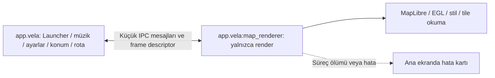

# Harita sürecini ayırma ve adım adım teşhis planı

Tarih: 5 Ekim 2026. Çalışılacak dal: **main**. Başlangıç commit'i: **d67a33a3c3d954346df607fe363679d6070c4b1e**.

## 1. İstenen sonuç

Launcher ana ekranı, Desktop workspace, müzik, ayarlar, yedekleme ve Home davranışı harita motorunun hatası yüzünden kapanmamalı. Harita ayrı süreçte çalışmalı. Yakalanabilir hatalar loga yazılmalı; harita alanında kısa bir açıklama ve elle yeniden deneme bulunmalı. Native süreç ölümü veya timeout da ana ekranda durum olarak gösterilmeli. Otomatik yeniden deneme/çökme döngüsü olmamalı.

Kullanıcı 5 Ekim 2026'da teyp yanında olmadığı için kod aşamalarının tek tek cihaz onayı beklenmeden tamamlanmasını istedi. Kod entegrasyonu, statik kontroller ve hosted CI bu oturumda tamamlanır; gerçek teyp, GPU, kaynak kullanımı ve yaşam döngüsü doğrulaması son sürümde yapılır. Kodun uygulanması cihaz kabul testinin geçtiği anlamına gelmez.
## 2. Yedek ve geri dönüş

Yedek dizini:
`D:/Projects/CarWorkspace/Vela-backups/2026-10-05-map-process-before-d67a33a3`

| Dosya | İçerik |
|---|---|
| repository-all-refs.bundle | Tüm mevcut Git refleri ve geçmişi; yaklaşık 254 MB |
| source-main.zip | d67a33a3 commit'indeki kaynaklar; yaklaşık 32 MB |
| local-files.zip | Git dışındaki yerel dosyalar, eski/yeni loglar ve varsa yerel yapılandırma/imzalama dosyaları; yaklaşık 58 MB |
| BACKUP_MANIFEST.json | Tam commit, dosya boyutları, SHA-256 ve yerel dosya listesi |
| GERI_YUKLEME.md | Mevcut projeyi ezmeden yeni dizine geri yükleme talimatı |
| bundle-verification.txt | Git bundle doğrulama çıktısı |

Yedek alınırken tracked/staged değişiklik yoktu. Bundle doğrulaması ve iki ZIP'in CRC kontrolü başarılı. Derleme önbellekleri ve üretilmiş build dizinleri kapsam dışı. Bu yedek telefon/teyp verilerini içermez. Yerel arşivler Git'e veya GitHub'a eklenmez. Her uygulama aşamasından önce çalışma durumu kaydedilir; geri alma için main history'sini reset/force-push etmek yerine ilgili değişiklikler revert edilir. Yedekten tam kurtarma gerekiyorsa önce yeni boş dizine klonlanır.

## 3. Mevcut bulgular ve sınırlar

- Teyp: alps L9211B, **API 27**, 32-bit `armeabi-v7a`. ROM sürüm metninde Android 10 yazması API 27 sınırlamalarını değiştirmez. Vela'nın gerçek minSdk'sı 26, compileSdk'sı 36.
- Son sürüm 0.4.67'de müzik indeksi 3767 parça/59 klasörle yükleniyor; otomatik tarama başlamıyor.
- Yeni rapor exception stack'i değil, beklenmedik süreç sonlanması raporu. Son işlem `map: create texture=false`; bu son işlem tek başına kesin çökme nedenini kanıtlamaz.
- Önceki 0.4.34 raporlarında `IllegalArgumentException → EGLImpl.eglCreateContext` var. Yeni süreç ölümünün aynı hata olduğunu doğrulamıyoruz.
- Çevrimdışı harita yüklenmeden de MapLibre/EGL başlatılıyor. Harita dosyalarını silmek grafik başlangıcını kapatmıyor.
- `CarIntegration.MapContainer` elle açılış kapısını taşıyor. `VelaMapView` çok sayıda harita davranışını tek görünümde topluyor. `MapViewModel` konum, arama, rota, ses ve veri depolarını birlikte yönetiyor.
- `CarMapRenderer` zaten MapSnapshotter ile Android Auto görüntüsü üretiyor; yeniden kullanılabilecek yaklaşım mevcut. `VelaMapView` ayrıca 768×768 warm snapshot oluşturuyor. İzolasyon sınırı yalnızca MapView değil, bütün native render/snapshot girişlerini kapsamalı.

Bir Java exception'ı ayrı render thread'inde yutmak güvenli toparlanmayı garanti etmez. SIGSEGV/SIGABRT'yi normal try/catch ile kurtarmaya çalışmayacağız. Ayrı süreç launcher'ı renderer süreç ölümünden ayırır; sistem genelindeki GPU sürücüsü çökmesi veya sistemin ana süreci bellek baskısıyla öldürmesi yine mutlak olarak önlenemez.

## 4. Mimari kararı ve API 27 görüntü yolu

Ana süreçte tek veri sahibi korunacak: konum, rota hesaplama/oturumu, sesli yönlendirme, Home, müzik ve ayarlar. Render süreci yalnızca gönderilen kamera/rota/tema/veri kaynağı bilgisini görüntüye dönüştürecek. Tam MainActivity veya MapViewModel ikinci kez çalıştırılmayacak.

Önerilen başlangıç bileşeni: car varyantında, `exported=false`, `android:process=":map_renderer"` olan bound service. `isolatedProcess=true` kullanılmayacak: aynı uygulamanın harita dosyalarına erişmek gerekiyor. Ayrı süreç aynı uygulama UID'sini kullanacak; bu bir güvenlik sandbox'ı değil, hata sınırıdır. Varsayılan uygulama process'i/Home activity'si taşınmayacak. Servis BOOT veya müzik olayıyla açılmayacak; sadece açık kullanıcı talebiyle bağlanılacak. İlk denemede ayrı foreground notification veya START_STICKY eklenmeyecek.

**API 27 görüntü yolu:** SurfaceControlViewHost API 30 gerektirir. Tam etkileşimli mevcut VelaMapView'ı korumak için Snapshotter/bitmap prototipi yerine private VirtualDisplay + Presentation seçildi. Launcher'daki SurfaceView'ın Surface nesnesi private bound service'e gönderilir; renderer bu çıkışa kendi Presentation/ComposeView/MapView ağacını çizer. PRIVATE + OWN_CONTENT_ONLY + PRESENTATION kullanılır; PUBLIC, AUTO_MIRROR ve SECURE kullanılmaz. Ekran yakalama veya MediaProjection izni istenmez. Cihazın sanal display/EGL sürücüsü uyumluluğu son teyp denemesinde doğrulanacaktır; in-process fallback yoktur.

Ana MapScreen, ViewModel, rota oturumu ve UI ana süreçte kalır. VelaMapView'ın native girişinden önce variant seam vardır. Car main process yüzeyi/IPC istemcisini, renderer process aynı mevcut VelaMapView kodunu çalıştırır. Standard varyant mevcut renderer'ını korur. 78 veri girdisi tipli, kotlinx.serialization ile kodlanan MapRenderScene üzerinden; 24 callback küçük JSON mesajlarıyla aktarılır. D-pad ve zoom komutları ayrı mesajdır. MotionEvent çoklu dokunma bilgisi yalnız harita Surface'inden Presentation'a iletilir; ViewModel/Activity taşınmaz.

Geometri descriptor üzerinden sıkıştırılmış JSON akışıyla aktarılır; ham JSON üst sınırı 16 MiB. Kodlama/çözme IO'da, en fazla bir okuyucu/yazıcı ve bir bekleyen son snapshot vardır. Descriptor gönderildikten sonra göndericide, okuma sonunda alıcıda kapatılır; geçici inode açık descriptor sayesinde yaşar, dosya adı hemen silinir. Bitmap kareleri Binder'dan geçmez. Ayarlar ana süreçteki snapshot'tan renderer'a kopyalanır; renderer'ın preference dosyaları renderer_ ve process suffix önekiyle ayrı tutulur; iki renderer da birbirinin preference dosyasına yazmaz. Kamera tuning, palet ve PiP durumu da aktarılır. Renderer indirme/yenileme veya müzik/konum servisi başlatmaz.

Android Auto'nun aynı anda ikinci bir Surface kullanabilmesi için ayrı private :map_renderer_auto servisi vardır. Mevcut host template/konum/rota sahibi korunur; main'deki Snapshotter yolu car varyantında bypass edilir. Renderer hata alırsa AA yüzeyindeki eski görüntü örtülür. Android Auto bu oturumda host/cihaz üzerinde denenmedi; kaynak entegrasyonu tamamlandı, görünüm/performans eşitliği kabul testi bekliyor.
## 5. Süreç başlangıcında çözülmesi gerekenler

İkinci süreçte de VelaApp ve manifest provider'ları başlatılabilir. Bu nedenle ilk kod değişikliği süreç ayrımı olmalı:

- API 28+ process-name API'si; API 26/27 için uyumlu process-name tespiti. Tespit başarısızlığı sessizce ana süreç diye kabul edilmemeli.
- Renderer süreçte Application gerekli temel kurulumu yapacak, fakat CarIntegration, müzik, bildirim dinleyicisi, telemetri, ses, wake listener, veri güncelleme/download ve ağır açılış işleri başlamayacak.
- Hilt Application/super.onCreate ve manifest auto-init provider bağımlılıkları incelenecek. Ana süreç bileşenlerinin injection üzerinden yanlışlıkla oluşturulmaması doğrulanacak.
- FileLogger iki süreçte aynı dosyaya yazıp rotate etmeyecek. Ana log ve render log ayrı olacak; her satır process adı, PID, session ID, aşama ve süre içerecek.
- ProcessDiagnostics'in mevcut `diag/process-session.json` yolu paylaşılmayacak. Süreç başına journal ve rapor adı kullanılacak. CrashCatcher renderer raporunu saklayıp yalnızca renderer'ın normal fatal sonlanmasına izin verecek; ana exception handler genel olarak susturulmayacak.
- Singleton/StateFlow/SharedPreferences iki süreç arasında ortak bellek değildir. Ayarların ve route state'in sahibi ana süreç olacak; renderer'a sürümlü snapshot gönderilecek. Renderer ayar veritabanına veya playlist'e yazmayacak.

## 6. IPC ve hata sözleşmesi

Önce düşük hacimli komutlar için Messenger/Bundle + request/session ID kullanılacak; gereksiz genel RPC altyapısı kurulmayacak. Renderer kamera ve frame işlemleri tek sıradan yürütülecek; Binder callback'inde uzun render veya disk işi yapılmayacak. Gerekirse performans ölçümünden sonra sınırlı AIDL sözleşmesine geçilecek.

Durumlar: OFF → CONNECTING → CONNECTED → ENGINE_INIT → RENDER_READY → STYLE_READY → DATA_READY → DRAWING → READY. Her aşama FAILED veya TIMED_OUT olabilir. Asenkron motorlarda stil ve render callback sıraları değişebilir; yalnızca bağımsız olaylar kaydedilir, henüz alınmamış EGL success olayı uydurulmaz.

Mesaj alanları: protocolVersion, sessionId, requestId, stage, event(start/success/failure), elapsedMs, process/PID ve kısa hata kodu. Frame mesajında generation, kamera özeti, width/height/format/size ve descriptor bulunur. Önceki session/generation callback'leri yok sayılır; descriptor ve bitmap kaynakları yine kapatılır.

Süreç ölümü ServiceConnection/binder death ile tespit edilir; bind başarısızlığı, null binding, disconnect, remote exception ve cevap gecikmesi ayrı yazılır. API'ye özel callback'ler SDK sınırlarıyla korunur. UI hiçbir remote çağrıyı uzun süre bekleyerek bloke etmez.

İlk bekleme sınırları başlangıç varsayımıdır: bind 5 saniye, motor 15 saniye, yerel tek frame 15 saniye. Ağ/stil yüklemesi ayrıca değerlendirilir; internet yokluğu EGL hatası sayılmaz. Süre aşımında ana ekran erişilebilir kalır. Otomatik reconnect/re-render yapılmaz; unbind ve eski session iptali uygulanır. Donmuş süreç temizlenecekse yalnızca doğrulanmış :map_renderer süreci, kendi kapatma isteği veya PID/start-time kontrolüyle hedeflenir; genel uygulama kill/force-stop kullanılmaz.

## 7. Uygulama durumu ve kalan doğrulama

| Aşama | Kod durumu | Son doğrulama |
|---|---|---|
| P0 yedek | Doğrulanmış Git bundle ve ZIP mevcut | Tamamlandı |
| P1 process ayrımı | Hafif Application, ayrı private servis, log/journal ayrımı | Gerçek PID/servis davranışı cihazda |
| P2 hata sınırı | Disconnect/binding death/null binding/timeout kartı; otomatik yeniden bağlanma yok; manuel retry | Süreç ölümü/donma, ana ekran ve müzik cihazda |
| P3 motor | Mevcut MapView ve warm Snapshotter renderer'da; library/map-create/stil/kare checkpoint'leri | API 27 EGL/VirtualDisplay cihazda |
| P4 stil | Yerel kaynaksız renderer-empty.json ve mevcut stil seçimleri | Ağsız boş motor ve gerçek stil cihazda |
| P5 çevrimdışı | Mevcut archive/source bilgisi ayrı sürece; descriptor akışı, boyut ve kuyruk sınırı | Gerçek/bozuk dosya seti cihazda |
| P6 etkileşim | Mevcut 78 girdi/24 callback, dokunma, D-pad, kamera, rota, favori/POI | Yatay/dikey, picking ve resize cihazda |
| P7 ek render yolları | Android Auto dahil car native girişleri süreç dışında; trim/teardown/log paylaşımı | Host, 3D/terrain, kaynak ve uzun çalışma cihazda |

Launcher açılışta harita başlatmaz. Harita alanında üç seçenek: Haritayı aç (tam özellikler); Boş harita motorunu dene (kaynak içermeyen yerel stil); Çevrimdışı dosyalar olmadan stili dene (archive overlay'leri kapalı). Haritayı kapat manuel kapıya döner. Her seçenek aynı APK'dadır; test için aşamalar arasında APK değiştirmek gerekmez.

Bağlantı 5 saniye, heartbeat yanıtı 15 saniye, ilk stil/kare 60 saniye sınırıyla izlenir. Stil hazır callback'i ile gerçek fully-rendered frame birlikte alınmadan UI hazır sayılmaz; didBecomeIdle tek başına kare kanıtı değildir. Stil değişince kare durumu sıfırlanır. Hata, ana loga ve diagnostic report'a session/PID/son aşamayla yazılır. Native neden bilinmiyorsa bilinmiyor olarak kaydedilir.

Harita arka plana alındığında veya Surface kaldırıldığında bağlantı bırakılır. Foreground dönüşünde yalnız açık harita yeniden bağlanır; hata sonrasında otomatik retry yapılmaz. Tekrar dene yeni UUID session açar, eski callback'ler reddedilir. Renderer'ın kapatılması ana süreç/Home/müzik için force-stop yapmaz. Donmuş renderer için hedef PID, process adı ve uygulama UID'si ActivityManager kaydında doğrulanmadan kill uygulanmaz.

Regresyon testleri: geçerli/geçersiz protocol-session-PID; 20.000 noktalı geometri, alternatifler, traffic spans, route bubble/favori/ayar roundtrip; POI koordinat callback'i ve navigasyon compass tüketimi. Hosted release job artık app:testCarReleaseUnitTest de çalıştırır. Yerel Gradle veya derleme taklidi çalıştırılmaz. Statik kaynak/XML/BOM/diff kontrolü derleme/cihaz testi yerine geçmez.
## 8. Kullanıcıya görünen durum

- Açılış: mevcut launcher veya Desktop; harita otomatik başlamaz.
- Deneme sırasında: harita alanında yükleniyor durumu; müzik/ayarlar erişilebilir.
- Yakalanan hata: “Harita açılamadı. Sorun: grafik başlatma.” gibi tek kısa kart; uygulama içinden ayrı error dialog açılmaz.
- Renderer ölümü: “Harita işlemi sonlandı. Son aşama: stil yükleme.” Neden bilinmiyorsa GPU veya bellek diye kesin etiket konmaz.
- Düğmeler: Yeniden dene, Haritayı kapat, Raporu paylaş. Yeniden dene yeni session ile yalnızca elle başlar.
- Harita sesi/rota devam ediyorsa görüntü olmadığı açık gösterilir; route güvenilir değilse yönlendirme başlamaz. Son frame güncel canlı konum gibi gösterilmez.

Android/OEM'in native süreç ölümünde gösterebileceği sistem hata ekranının her ROM'da bastırılacağı vaat edilmez; hedefimiz ana sürecin çalışması ve uygulama içinde tekrarlanan popup/yeniden başlatma döngüsü olmamasıdır.

## 9. Ölçülebilir kabul ölçütleri

1. Renderer PID farklı; kontrollü renderer death sonrası ana PID değişmiyor.
2. Harita hatasında Home, Desktop, ayarlar ve müzik yanıt vermeye devam ediyor.
3. Her deneme stage/session bilgili tek raporla izleniyor; API 27'de native hata nedeni bilinmiyorsa bu açık belirtiliyor.
4. Ağ yokken yerel test çalışıyor; harita bulunmaması cihazı kilitlemiyor.
5. Tek renderer/tek aktif render; duplicate müzik/konum/voice/foreground servis yok.
6. Home aynı task'a döner; uygulamayı kapat/launcher restart mevcut semantiği korur.
7. Başarısız aşama sonrasında otomatik döngü yok; yeni deneme kullanıcıdan gelir.
8. Fonksiyon, performans ve kaynak denetimleri geçmeden mevcut interaktif renderer kaldırılmaz. İzole mod açıkken eski in-process renderer'a sessiz fallback yapılmaz.

## 10. Dosya ve uygulama sırası

İlk değişiklikler `app/src/car/AndroidManifest.xml`, car variant CarIntegration ve yeni renderer service/IPC client ile sınırlı olacak. VelaApp'in process ayrımı ve log/journal process ayrımı ortak katmanda kontrollü eklenecek. Standard varyant için mevcut davranış korunacak; gerekiyorsa variant seam no-op sağlanacak. Sonraki entegrasyon MapScreen/VelaMapView'de dar renderer sınırı kuracak; MapViewModel taşınmayacak. Yeni strings car values/values-tr kaynaklarında tutulacak.

Değişiklikler main'e gönderilir; mevcut Build APK iş akışı APK ve JVM regresyon testlerini çalıştırır. Bu oturumda yerel Gradle ve emülatör kullanılmaz. CI sonucu burada kaydedilir; teybin son kabul denemesi kullanıcı cihazı erişilebilir olduğunda yapılır.

Son kabul denemesi: haritasız launcher/Desktop/müzik; boş motor; dosyasız stil; tam harita; favori/rota/dokunma; haritayı kapat/yeniden aç; Home/arka plan/ön plan; yatay/dikey/panel resize; renderer death ve timeout; tek müzik bildirimi; uzun çalışma/bellek; offline yedek yükleme. Başarısızlıkta ana ekran kullanılabiliyorsa renderer logu ve diagnostics raporu gönderilir. Başarısızlık halinde eski in-process harita otomatik açılmaz.

**Mevcut durum:** kaynak entegrasyonu tamamlandı; CI ve gerçek cihaz doğrulaması ayrı takip edilir. Teypte tam özellik eşitliği veya GPU uyumluluğu henüz doğrulanmadı.

Son kaynak kontrolünde eklendi: VirtualDisplay metrics değişiminde Presentation/Compose/MapView yaşam döngüsü yenilenir; eski pencere tutulmaz. Native library/map-create/style-loading girişinden önce journal worker'a sınırlı flush bariyeri konur. Hata raporu renderer journal'ını da ekler. Yeniden denemede eski Binder'ın sonlanması için kısa grace uygulanır. Ana ekranın density/fontScale ve yönü ayrı yüzeyde korunur.
## 11. Teknik kaynaklar

- [DisplayManager / private VirtualDisplay](https://developer.android.com/reference/android/hardware/display/DisplayManager): private OWN_CONTENT_ONLY display, Surface çıkışı, resize/release ve flag izinleri.
- [Presentation](https://developer.android.com/reference/android/app/Presentation): display'e özel pencere ve kaynak bağlamı.

- [Android süreç ve thread modeli](https://developer.android.com/guide/components/processes-and-threads): component process ayarı ve IPC sınırı.
- [Bound services](https://developer.android.com/develop/background-work/services/bound-services): remote servis ve Messenger sözleşmesi.
- [SurfaceControlViewHost](https://developer.android.com/reference/android/view/SurfaceControlViewHost): API 30+; API 27 teybin ortak görüntü yolu olamaz.
- [MapLibre MapSnapshotter](https://maplibre.org/maplibre-native/android/api/-map-libre%20-native%20-android/org.maplibre.android.snapshotter/-map-snapshotter/index.html): mevcut Android Auto yaklaşımının dayandığı public SDK sınıfı; tam etkileşimli MapView eşitliği varsayılmaz.
